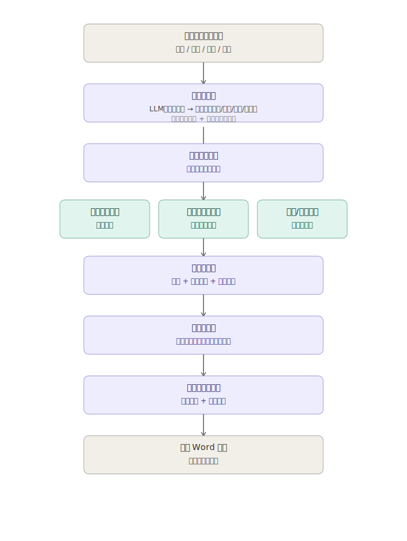

# 招投标信息智能聚合工具

用自然语言描述需求（主题 / 区域 / 时间 / 频率），自动完成"多源抓取 → 清洗去重 → 结构化汇总 → 定时增量推送"，最终产出可追溯的 Word 报告。

> 本仓库为 xx 赛题的参赛项目，当前处于开发阶段，完成度见下方「当前进度」。

## 示例

```bash
python -m src.main "最近3个月的上海区域内的充电桩招标信息都有哪些，请汇总后每天9:00发送给我"
```

系统会自动解析出：主题=充电桩，地域=上海，时间范围=最近3个月，频率=每天9:00，
并在该时间点持续抓取、去重、汇总，生成 `outputs/最近3个月的上海区域内的充电桩招标信息都有哪些_202607171424.docx`。

## 架构



```
用户自然语言输入
   -> 意图解析层        src/intent/            LLM结构化抽取 + 规则兜底
   -> 数据源适配层       src/adapters/          插件化多站点抓取（含1个需登录源）
   -> 清洗去重层         src/pipeline/cleaner.py, deduplicator.py
   -> 汇总生成层         src/pipeline/summarizer.py    五要素结构化摘要（可溯源）
   -> 调度/增量推送层     src/scheduler/         定时执行 + 已推送指纹去重
   -> 输出 Word 报告      src/document/docx_builder.py
```

## 目录结构

```
tender-info-aggregator/
├── config/
│   └── sources.yaml          # 数据源配置清单
├── src/
│   ├── intent/
│   │   ├── rule_parser.py    # 规则版意图解析（已实现，可运行）
│   │   └── llm_parser.py     # LLM版意图解析（接口已实现，需配置 API Key）
│   ├── adapters/
│   │   ├── base_adapter.py           # 适配器抽象基类
│   │   ├── gov_platform_adapter.py   # 政府公示平台（免登录）
│   │   ├── login_required_adapter.py # 需登录标讯网站（免费会员）
│   │   └── aggregator_site_adapter.py# 行业/商业聚合站点
│   ├── pipeline/
│   │   ├── cleaner.py         # 去噪 + 条件筛选
│   │   ├── deduplicator.py    # 指纹去重
│   │   └── summarizer.py      # 结构化摘要（五要素）
│   ├── scheduler/
│   │   ├── job_scheduler.py   # APScheduler 封装
│   │   └── state_store.py     # 已推送指纹存储（增量推送依据）
│   ├── document/
│   │   └── docx_builder.py    # Word 文档生成
│   └── main.py                 # 主入口，串联全流程
├── docs/
│   ├── 详设文档.md
│   └── architecture.svg
├── tests/
│   └── test_intent_parser.py
├── data/            # 运行时生成的状态库/登录态缓存（已加入 .gitignore）
├── outputs/         # 运行时生成的 Word 报告（已加入 .gitignore）
├── requirements.txt
└── .gitignore
```

## 安装与运行

```bash
git clone <本仓库地址>
cd tender-info-aggregator
pip install -r requirements.txt
playwright install chromium   # 若使用 Playwright 处理动态渲染/登录态页面

# 如需使用 LLM 版意图解析
export ANTHROPIC_API_KEY=你的key

python -m src.main "最近1个月的安徽省区域内的服务器招标信息都有哪些"
```

## 运行测试

```bash
pytest tests/ -v
```

## 当前进度

| 模块 | 状态 |
|---|---|
| 意图解析（规则版） | ✅ 已实现并通过单元测试 |
| 意图解析（LLM版） | ✅ 接口已实现，待接入真实网站验证 |
| 数据源适配层 | 🚧 接口与抽象基类已定义，3 个适配器待接入真实网站抓取逻辑 |
| 清洗去重 | 🚧 指纹去重已实现，噪声规则待用真实页面样本补充 |
| 汇总生成 | 🚧 抽取式摘要框架已实现，待接入真实数据验证事实一致性 |
| 调度与增量推送 | ✅ 调度封装 + 增量状态存储已实现 |
| Word 文档生成 | ✅ 已实现，文件命名规则已对齐赛题要求 |

## 后续计划

- [ ] 为 3 个 adapter 接入真实招投标网站的检索与详情解析逻辑
- [ ] 补充关键词同义词表，提升清洗阶段的筛选召回率
- [ ] 为汇总模块接入 LLM 精炼摘要（严格约束"禁止编造原文未提及信息"）
- [ ] Web UI（可选，视时间情况使用轻量前端展示订阅任务与历史报告）
